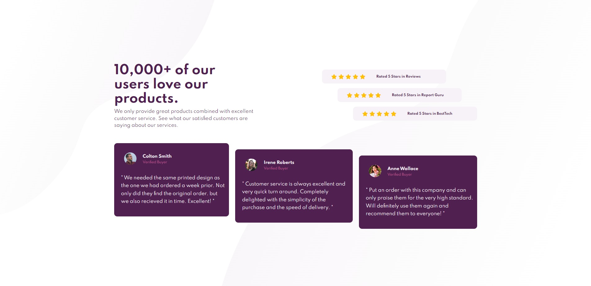

- Overview:
  - [Social Proof Section Master](#the-challenge)
  - [https://wella4life.github.io/Challenge_6_Easy/](#links)
  - 

 - Users should be able to:
   - View the optimal layout for the site depending on their device's screen size

 - What I Learned:
   - Setting everything as it as and using margin helps
   - Margin pushes other content away
   - Padding pushes your own content away
 
 - What I Couldn't Do:
   - Mobile version was tricky
   - to be honest, I was lazy
